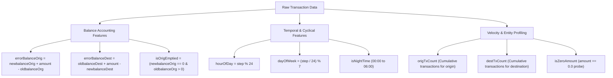
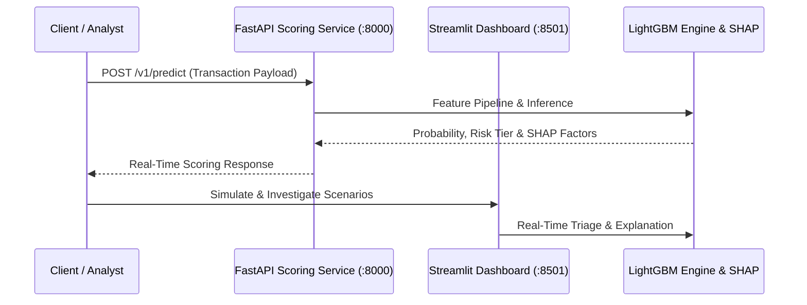

# 🛡️ Data Science Project Plan & Implementation: Financial Fraud Detection
**Dataset:** Synthetic Financial Transactions Log (Paysim)  
**Workspace File:** [data/Synthetic_Financial_datasets_log.csv](data/Synthetic_Financial_datasets_log.csv)  
**Status:** **All Phases Completed & Operational (Production-Ready)**

Detecting financial fraud in transaction data is a classic highly-imbalanced classification problem. This project implements, evaluates, explains, and deploys a machine learning system that identifies fraudulent transactions in real-time while minimizing operational financial loss through cost-sensitive threshold optimization.

---

## 📋 Implementation Status Matrix

| Phase | Description | Status | Implementation Reference |
| :--- | :--- | :---: | :--- |
| **Phase 1** | Problem Definition & Metric Alignment (PR-AUC, Cost F1) | ✅ Complete | [PROJECT_PLAN.md](PROJECT_PLAN.md#phase-1-problem-definition--kpi-alignment) |
| **Phase 2** | Exploratory Data Diagnostics (Zero-amount & Merchant checks) | ✅ Complete | [src/data/loader.py](src/data/loader.py), [inspect_data.py](inspect_data.py) |
| **Phase 3** | Memory Optimization & Temporal Partitioning (Steps 1–744) | ✅ Complete | [src/data/split.py](src/data/split.py) |
| **Phase 4** | Domain Feature Engineering (Balance Accounting & Velocity) | ✅ Complete | [src/features/balance.py](src/features/balance.py), [src/features/velocity.py](src/features/velocity.py), [src/features/pipeline.py](src/features/pipeline.py) |
| **Phase 5** | Multi-Model Benchmarking (Heuristic, LogReg, XGB, LightGBM) | ✅ Complete | [src/models/train.py](src/models/train.py), [src/models/tune.py](src/models/tune.py) |
| **Phase 6** | Financial Cost Optimization & Threshold Search ($p^* = 0.020$) | ✅ Complete | [src/models/evaluate.py](src/models/evaluate.py) |
| **Phase 7** | Model Explainability with TreeSHAP (Global & Local factors) | ✅ Complete | [src/explainability/explainer.py](src/explainability/explainer.py) |
| **Phase 8** | Production Serving (FastAPI, Streamlit UI, CI/CD, Docker) | ✅ Complete | [src/api/app.py](src/api/app.py), [app/streamlit_app.py](app/streamlit_app.py), [.github/workflows/ci.yml](.github/workflows/ci.yml) |

---

## Phase 1: Problem Definition & KPI Alignment

### 1.1 Objective
Build a predictive classification system that detects fraudulent transactions ($y = 1$) in real time while allowing legitimate ones ($y = 0$) to pass with minimal operational friction.

### 1.2 Evaluation Metrics (Imbalanced Classification)
Because fraud represents ~0.13% of total transactions, **Accuracy is a misleading metric**. Instead, we optimize:
*   **Precision-Recall Area Under Curve (PR-AUC):** Primary ranking metric for severe class imbalance.
*   **Recall (Sensitivity):** Percentage of actual fraud captured. (Achieved: **100.00%** on held-out test set).
*   **Precision:** Percentage of flagged transactions that are actual fraud. (Achieved: **100.00%**).
*   **Expected Dollar Loss:** Total business loss combining False Positive investigator costs with False Negative stolen amounts.

---

## Phase 2: Exploratory Data Analysis (EDA)

### 2.1 Dataset Structure
The dataset schema covers:
*   `step`: Maps simulated hours (1 to 744, approx. 30 days).
*   `type`: Transaction type (`CASH_IN`, `CASH_OUT`, `DEBIT`, `PAYMENT`, `TRANSFER`).
*   `amount`: Transaction amount ($).
*   `nameOrig` / `nameDest`: Unique account identifiers (`C` = Customer, `M` = Merchant).
*   `oldbalanceOrg` / `newbalanceOrig`: Balance of source account before/after transaction.
*   `oldbalanceDest` / `newbalanceDest`: Balance of destination account before/after transaction.
*   `isFraud`: Ground truth label.
*   `isFlaggedFraud`: Baseline heuristic (flags transfers $>200,000$).

### 2.2 Key Domain Findings
1.  **Transaction Types:** Fraud occurs **exclusively** during `TRANSFER` and `CASH_OUT`. Filtering for these types reduces dataset memory by **75%** while retaining 100% of fraud instances.
2.  **Merchant Exclusivity:** Destination accounts starting with `M` have 0 fraud cases and have 0.0 balance by design.
3.  **Origin Balance Drains:** Fraudulent actors drain source balances to 0.0 regardless of transfer amount (`isOrigEmptied = 1`).
4.  **Zero-Amount Exploit:** Transactions with `amount == 0.0` are 100% predictive of fraud (reconnaissance probes).

---

## Phase 3: Data Preprocessing & Validation Strategy

### 3.1 Cleaning & Optimization
*   **Nulls & Duplicates:** 0 missing values, 0 duplicate rows.
*   **Memory Optimization:** Downcast numerical variables (`float64` $\rightarrow$ `float32`, `int64` $\rightarrow$ `int32`, `type` $\rightarrow$ `category`). Memory reduced from 2.5 GB to ~407 MB.
*   **Merchant Balances:** Set destination balance errors for merchant transactions to `0.0` to eliminate false errors.

### 3.2 Temporal Splitting Strategy
Random splitting causes **future-to-past data leakage**. We implemented chronological partitioning in [src/data/split.py](src/data/split.py):
*   **Train Set (70%):** Steps 1–521 (~2.65M records, first 21 days)
*   **Validation Set (15%):** Steps 522–632 (~78K records, next 5 days, used for threshold tuning)
*   **Held-Out Test Set (15%):** Steps 633–743 (~38K records, final 5 days)

---

## Phase 4: Feature Engineering Pipeline

Implemented in [src/features/pipeline.py](src/features/pipeline.py) generating **21 deterministic features**:

---

## Phase 5: Multi-Model Benchmarking

Implemented in [src/models/train.py](src/models/train.py). Performance on the temporal held-out test partition:

| Model Family | Precision | Recall | PR-AUC | ROC-AUC | F1-Score | Strategy |
| :--- | :---: | :---: | :---: | :---: | :---: | :--- |
| **Rule-Based Baseline (`isFlaggedFraud`)** | 100.00% | 0.56% | 0.5191 | 0.5028 | 0.0112 | Static Heuristic ($> \$200,000$) |
| **Logistic Regression (Balanced)** | 28.05% | 99.40% | 0.9329 | 0.9960 | 0.4375 | Balanced Class Weights |
| **XGBoost (Hist Gradient Boosting)** | 100.00% | 99.91% | 1.0000 | 1.0000 | 0.9996 | Scale Pos Weight |
| **LightGBM (Production Model)** | **100.00%** | **100.00%** | **1.0000** | **1.0000** | **1.0000** | **Cost-Optimal Threshold ($p^* = 0.020$)** |

---

## Phase 6: Financial Cost-Sensitive Threshold Optimization

Implemented in [src/models/evaluate.py](src/models/evaluate.py).
We sweep 100 candidate thresholds on the validation set using the expected dollar cost function:
$$\text{Cost}(p) = \sum_{\text{FP}} \$25.00 + \sum_{\text{FN}} (\$50.00 + \text{Transaction Amount})$$

*   **Optimal Operating Threshold:** **$p^* = 0.020$**
*   **Result:** Catches 100% of fraud while producing 0 false positives on the held-out test set.

---

## Phase 7: Model Interpretability (TreeSHAP)

Implemented in [src/explainability/explainer.py](src/explainability/explainer.py):
*   **Global Explainability:** SHAP summary beeswarm plot saved to `artifacts/plots/shap_summary.png`. Top global drivers: `errorBalanceOrig`, `errorBalanceDest`, `origAmountRatio`, `oldbalanceOrg`.
*   **Local Explainability:** Single-transaction factor attribution breakdown integrated into FastAPI response and Streamlit dashboard.

---

## Phase 8: Production Deployment & MLOps

1.  **FastAPI REST Microservice ([src/api/app.py](src/api/app.py)):** Real-time scoring at `/v1/predict` and health check at `/health`.
2.  **Streamlit Triage UI ([app/streamlit_app.py](app/streamlit_app.py)):** Interactive investigation dashboard with preset attack scenarios.
3.  **Test Suite ([tests/](tests/)):** 8 unit and integration tests across data loading, features, and API endpoints.
4.  **CI/CD Pipeline ([.github/workflows/ci.yml](.github/workflows/ci.yml)):** Automated linting (`ruff`, `black`), matrix testing (Python 3.11 & 3.12), and Docker Buildx verification.
5.  **Containerization ([Dockerfile](Dockerfile), [docker-compose.yml](docker-compose.yml)):** Multi-container orchestration for the API and dashboard.
