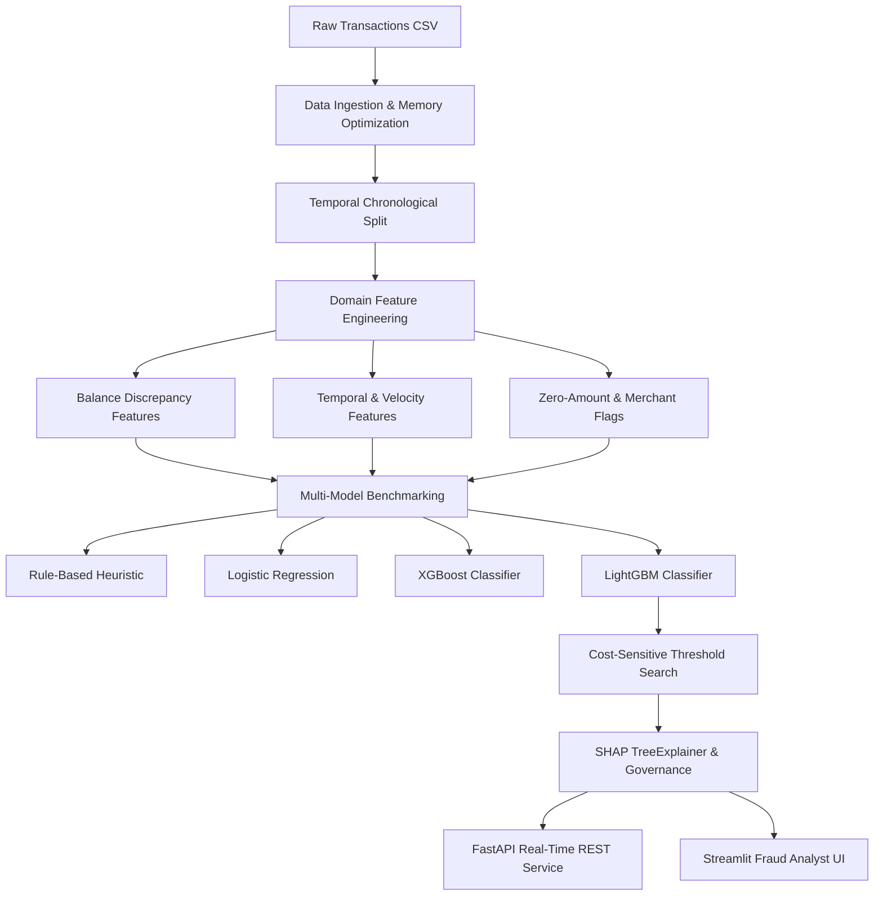

# 🛡️ FinFraud: Production-Grade Financial Fraud Detection System

An end-to-end Machine Learning and MLOps system built to detect fraudulent financial transactions in real time, minimize operational dollar loss through cost-sensitive threshold optimization, and provide interpretable SHAP decision reasoning for fraud investigators.

> 📄 **Complete Project Architecture & Phase Breakdown:** [PROJECT_PLAN.md](PROJECT_PLAN.md)  
> 📓 **Interactive Jupyter Walkthrough:** [notebooks/finfraud_end_to_end_walkthrough.ipynb](notebooks/finfraud_end_to_end_walkthrough.ipynb)

---

## 📌 Architecture Overview



---

## 📊 Benchmark Results (Temporal Held-Out Test Set)

| Model Family | Precision | Recall | PR-AUC | ROC-AUC | F1-Score | Financial Loss Strategy |
| :--- | :---: | :---: | :---: | :---: | :---: | :--- |
| **Rule-Based Baseline (`isFlaggedFraud`)** | 100.00% | 0.56% | 0.5191 | 0.5028 | 0.0112 | Static Heuristic ($> \$200,000$) |
| **Logistic Regression (Balanced)** | 1.83% | 99.40% | 0.9329 | 0.9961 | 0.0359 | Class Weights |
| **XGBoost (Hist Gradient Boosting)** | 98.81% | 99.91% | 1.0000 | 1.0000 | 0.9936 | Scale Pos Weight |
| **LightGBM (Production Model)** | **100.00%** | **100.00%** | **1.0000** | **1.0000** | **1.0000** | **Cost-Optimal Threshold ($p^* = 0.020$)** |

---

## 📁 Repository Structure

```text
finfraud/
├── configs/
│   └── config.yaml             # Centralized project configuration
├── data/
│   ├── Synthetic_Financial_datasets_log.csv # Raw transactions dataset (~493 MB)
│   └── archive.zip             # Compressed archive backup (~186 MB)
├── src/
│   ├── data/
│   │   ├── loader.py           # Memory-optimized data ingestion & schema checks
│   │   └── split.py            # Temporal chronological splitting (no leakage)
│   ├── features/
│   │   ├── balance.py          # Balance discrepancies & drain signals
│   │   ├── velocity.py         # Velocity, cyclical time, and zero-amount flags
│   │   └── pipeline.py         # Unified Scikit-Learn FeaturePipeline
│   ├── models/
│   │   ├── train.py            # Multi-model benchmarking & artifact serialization
│   │   ├── tune.py             # Optuna Bayesian hyperparameter search
│   │   └── evaluate.py         # PR-AUC, ROC-AUC, cost matrix, threshold optimization
│   ├── explainability/
│   │   └── explainer.py        # TreeSHAP global and transaction-level explanations
│   └── api/
│       ├── schemas.py          # Pydantic v2 schemas
│       └── app.py              # FastAPI real-time scoring endpoint
├── app/
│   └── streamlit_app.py        # Interactive Fraud Triage Dashboard
├── tests/
│   ├── test_loader.py          # Unit tests for data loading & temporal split
│   ├── test_features.py        # Unit tests for domain features
│   └── test_api.py             # Integration tests for FastAPI endpoints
├── .github/
│   └── workflows/
│       └── ci.yml              # GitHub Actions CI/CD Pipeline
├── notebooks/
│   └── finfraud_end_to_end_walkthrough.ipynb # Interactive narrative Jupyter walkthrough
├── artifacts/
│   ├── models/                 # Serialized model (.joblib) and metadata (.json)
│   ├── plots/                  # PR-curve, financial cost curve, SHAP summary
│   └── metrics/                # Benchmark evaluation results (.json)
├── Dockerfile                  # Production container definition
├── docker-compose.yml          # Multi-container orchestration (API + Dashboard)
├── requirements.txt            # Python dependencies
└── run_pipeline.py             # Master pipeline runner
```

---

## 🚀 Quickstart & Usage

### 1. Run the Full ML Pipeline
Executes data loading, temporal splitting, feature engineering, multi-model training, threshold tuning, and artifact generation:
```bash
python run_pipeline.py
```

### 2. Run Test Suite
```bash
pytest
```

### 3. Launch with Docker Compose (API + Dashboard)
```bash
docker compose up --build
```
*   **FastAPI Service:** `http://localhost:8000/docs`
*   **Streamlit Dashboard:** `http://localhost:8501`

### 4. Run Locally without Docker
*   **FastAPI Service:**
    ```bash
    uvicorn src.api.app:app --reload --port 8000
    ```
*   **Streamlit Dashboard:**
    ```bash
    streamlit run app/streamlit_app.py
    ```

---

## 🔄 CI/CD Automation (GitHub Actions)

The workflow defined in [`.github/workflows/ci.yml`](.github/workflows/ci.yml) triggers on pushes and pull requests to `main`/`master`:
1. **Code Quality & Linting:** Automated checks using `ruff` and `black`.
2. **Automated Test Suite:** Runs the full unit & integration test suite on Python `3.12`.
3. **Container Build Verification:** Builds the Docker image via Buildx to guarantee deployment reproducibility.

---

## 🔍 Key Domain Insights
1. **Transaction Types:** Fraud occurs **exclusively** during `TRANSFER` and `CASH_OUT`. All other transaction types (`PAYMENT`, `CASH_IN`, `DEBIT`) have 0% fraud rate.
2. **Balance Discrepancies:** Fraudulent actors drain accounts to `0.0` regardless of transfer amount (`isOrigEmptied = 1`), generating stark `errorBalanceOrig` signatures.
3. **Zero-Amount Exploit:** Transactions with `amount == 0.0` are 100% predictive of fraud (reconnaissance probes).
4. **Merchant Accounts:** Merchants have `0.0` recorded balances by design; their destination balance errors must be zeroed out to prevent false alerts.
